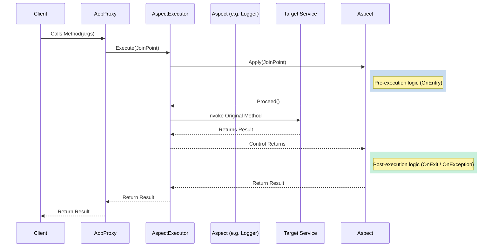

# Architecture

  <strong>English</strong> | <a href="../es/architecture.md">Español</a>

The BeyondNet.Aop framework is designed for high performance and clean separation of concerns. It leverages the native `.NET` `System.Reflection.DispatchProxy` to build a dynamic interception pipeline at runtime.

## Core Components and Responsibilities

- **`AopProxy<TService, TImplementation>`**: The core proxy class. It acts as a transparent wrapper around the target service, intercepting every method call.
- **`IAspectExecutor`**: Orchestrates the chain of aspects. It determines which aspects apply to the current method and executes them in the correct order.
- **`IJoinPoint`**: The contextual object passed through the pipeline. It holds the method arguments, the `MethodInfo`, the target instance, and provides the `Proceed()` method to continue execution.
- **`AbstractAspect<T>`**: The base class for all aspects. It reads the aspect configuration from the custom attributes decorating the intercepted method.

## The Interception Pipeline

When a method is called on an advised service, the flow goes as follows:

## Performance & Caching

Reflection in .NET is historically slow. To ensure that BeyondNet.Aop can be used in highly-concurrent and high-throughput environments, we implemented several caching layers:

1. **Method Resolution Cache**: Maps interface methods to concrete implementation methods in O(1) time.
2. **Attribute Lookup Cache**: `AbstractAspect` heavily caches the lookup of custom attributes via `ConcurrentDictionary`.
3. **Expression Evaluation Cache**: Dynamic string expressions evaluated at runtime (e.g., extracting a nested ID from an object argument) are compiled into fast `Delegate` instances and cached indefinitely.
