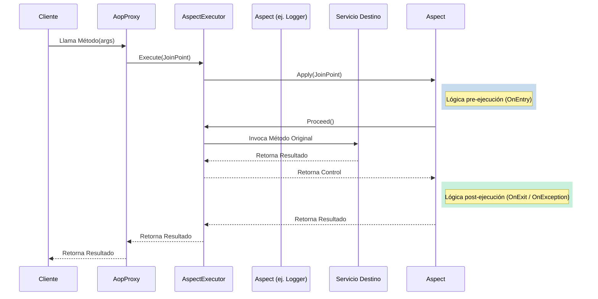

# Arquitectura

  <a href="../en/architecture.md">English</a> | <strong>Español</strong>

El framework BeyondNet.Aop está diseñado para un alto rendimiento y una clara separación de responsabilidades. Aprovecha el `System.Reflection.DispatchProxy` nativo de `.NET` para construir un pipeline de intercepción dinámico en tiempo de ejecución.

## Componentes Centrales y Responsabilidades

- **`AopProxy<TService, TImplementation>`**: La clase proxy principal. Actúa como un envoltorio transparente alrededor del servicio destino, interceptando cada llamada a un método.
- **`IAspectExecutor`**: Orquesta la cadena de aspectos. Determina qué aspectos aplican al método actual y los ejecuta en el orden correcto.
- **`IJoinPoint`**: El objeto contextual que viaja a través del pipeline. Contiene los argumentos del método, la metadata (`MethodInfo`), la instancia destino, y provee el método `Proceed()` para continuar la ejecución.
- **`AbstractAspect<T>`**: La clase base para todos los aspectos. Lee la configuración del aspecto desde los atributos personalizados que decoran el método interceptado.

## El Pipeline de Intercepción

Cuando se llama a un método en un servicio interceptado, el flujo es el siguiente:

## Rendimiento y Caché

Históricamente, la reflexión en .NET es lenta. Para asegurar que BeyondNet.Aop pueda ser usado en entornos de alta concurrencia, implementamos varias capas de caché:

1. **Caché de Resolución de Métodos**: Mapea métodos de interfaz a métodos de implementación en tiempo O(1).
2. **Caché de Búsqueda de Atributos**: `AbstractAspect` cachea fuertemente la búsqueda de atributos personalizados usando `ConcurrentDictionary`.
3. **Caché de Evaluación de Expresiones**: Las expresiones de cadenas dinámicas evaluadas en tiempo de ejecución (ej. extraer un ID anidado de un objeto argumento) son compiladas a instancias de delegados (`Delegate`) muy rápidas y se guardan en caché indefinidamente.
